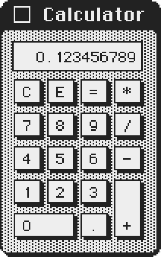

# Classic Calculator

  

  <strong>A pixel-perfect native macOS recreation of the legendary 1984 Macintosh Calculator Desk Accessory.</strong> 
  Built with pure SwiftUI &amp; AppKit. Free forever. Universal binary for Apple Silicon &amp; Intel.

  
  
  
  

---

## Overview

**Classic Calculator** brings the original 1984 Macintosh Calculator Desk Accessory into the modern macOS era. 

First developed by **Chris Espinosa**, guided by **Steve Jobs**, with UI implementation by **Andy Hertzfeld** and iconography by **Susan Kare**, the System 1 Calculator is one of the most recognizable pieces of software ever created. 

This project faithfully resurrects that experience as a lightweight, blazing-fast native macOS utility designed to live alongside modern workflows without compromise.

> **Note**: This repository serves as the official distribution hub for pre-compiled binaries, release notes, issue tracking, and documentation. Source code is maintained privately.

---

## Highlights & Features

- **Retina-Sharp Vector Pixel Art**: Every border, button, and line is rendered using pure SVG vector paths with crisp pixel-edge rendering. It stays mathematically sharp at 1×, 2×, 3×, and 4× integer scales on 4K, 5K, and 6K Pro Display XDR screens.
- **Authentic 1984 Audio Engine**: Every keystroke triggers a sub-millisecond, synthesized 40ms mechanical relay snap, recreating the physical tactile snap of early Macintosh keyboards. Sound can be toggled on or off instantly.
- **Bespoke 7px LCD Bitmap Display**: Employs the custom `MacCalculatorDisplay` bitmap typeface to faithfully replicate the exact digit geometry and right-aligned numeral spacing of the original 1984 screen.
- **Three Authentic Schemes**:
  - **Classic Platinum**: The original 1984 rich title bar and beige desk aesthetic.
  - **Inactive State**: The hollow outline title bar that reacts when focus shifts to other applications.
  - **Monochrome**: Pure high-contrast black and white for focused computing.
- **Native macOS Polish**:
  - **Always on Top**: Pin the calculator above code editors, spreadsheets, and full-screen apps.
  - **Native Window Shadow**: Toggle authentic macOS window shadows on or off in Settings.
  - **Menu Bar Quick Access**: Instant launch and control from the macOS menu bar.
  - **Full Keyboard Support**: Seamless support for physical number pads, standard top-row number keys, `Return`, `Enter`, `Esc`, `C`, `E`, and `Backspace`.
  - **Native About Window**: Standard macOS About dialog with authentic retro credits.

---

## How It Was Made

Classic Calculator was hand-crafted from the ground up using modern native Apple technologies:

- **100% Hand-Crafted — No AI**: **No AI tools or code generators were used** in the design, pixel-art drafting, audio synthesis, or Swift implementation. Every single coordinate, pixel boundary, vector path, sound envelope, and keystroke handler was manually measured, plotted, and refined by hand against original 1984 System 1.0 ROM dumps and folklore archives.
- **Pure Swift & SwiftUI + AppKit**: Built directly against Apple's first-party frameworks for zero battery drain, zero background overhead, and native 60/120 FPS ProMotion responsiveness.
- **Zero Dependencies & Zero Bloat**: Contains zero external third-party frameworks, zero analytics, zero daemons, and zero background tracking. The entire universal binary bundle weighs under 15MB.

---

## Downloads & Installation

Pre-compiled, notarized universal binaries are available on the [Releases](https://github.com/19JVJeffery/ClassicCalculator/releases) page.

1. Download the latest `ClassicCalculator.zip` or `.dmg` from [Releases](https://github.com/19JVJeffery/ClassicCalculator/releases).
2. Decompress and drag **Classic Calculator.app** into your `/Applications` folder.
3. Launch and enjoy.

### System Requirements

- **Operating System**: macOS 13.0 Ventura, macOS 14 Sonoma, macOS 15 Sequoia, or later.
- **Hardware**: Universal binary natively supporting both **Apple Silicon** (M1, M2, M3, M4 series) and **Intel** Macs.

---

## Historical Heritage

In autumn 1983, Chris Espinosa wrote the original calculator for the upcoming Macintosh. Steve Jobs repeatedly rejected prototypes, complaining about line thicknesses, button dimensions, and gap sizes. 

Rather than guessing what Jobs wanted, Espinosa spent an afternoon coding the **"Calculator Construction Set"** — a visual control panel that let Jobs adjust line widths, margins, and button sizes directly with sliders. Jobs tuned it for an hour, settled on his ideal parameters, and those exact proportions shipped with System 1.0 on 24 January 1984.

Classic Calculator honors that craftsmanship by adhering to those exact dimensions, proportions, and spirit.

---

## Website & Documentation

Visit the official website for interactive previews and sound auditions:  
👉 **[https://19jvjeffery.github.io/ClassicCalculator/](https://19jvjeffery.github.io/ClassicCalculator/)**

---

## Legal Notice

Classic Calculator is an independent, non-commercial native utility created out of love for classic computing history.  
Not affiliated with, sponsored by, or endorsed by Apple Inc. Macintosh, macOS, and SwiftUI are trademarks of Apple Inc.
